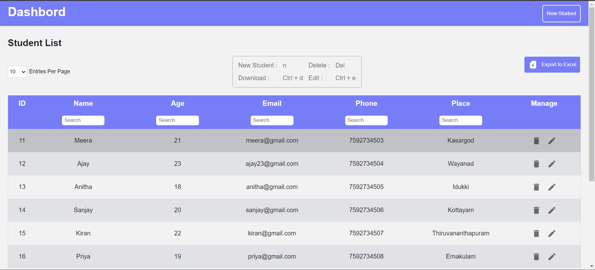

# Dashbord




## Description

This documentation outlines the steps to create a responsive and accessible dashboard using React, Vite, Material-UI (MUI), and Styled Components. The dashboard includes features such as tables with filtering options, pagination, CRUD operations, and data export to Excel. It adheres to accessibility standards and ensures a professional and user-friendly design.

Live Demo : https://dashboard-11ktxyrw9-sreesanjays-projects.vercel.app/

features

-    Responsive Data table with pagination
-    Create new students
-    Edit student details
-    Delete students
-    Search filter
-    Download table content as excel
-    Keyboard shortcut for easy accessing

Tech-Stack

-    React.js
-    Typescript
-    Material UI
-    Styled Components
-    hotkeys-js
-    xlsx

## Project Setup

Prerequisites

-    Node.js (v20 or later)
-    npm or yarn

## Installation Steps
1. Cone the repo using

  ```
  git clone https://github.com/Sreesanjay/dashboard.git
  ```

2. Install dependencies

  ```
    cd dashboard
    npm install
  ```

3. Run this project on your local server by using this command

  ```
  npm run dev
  ```

## Implementation of a sample react vite application with material ui and styled component

Initialize the project with Vite:

```
npm create vite@latest dashboard
```
- Select React and typescript option
```
cd dashboard
```

Install necessary dependencies:

```
npm install @emotion/react @emotion/styled @mui/icons-material @mui/material styled-components 
```

Start the development server:
```
npm run dev
```


